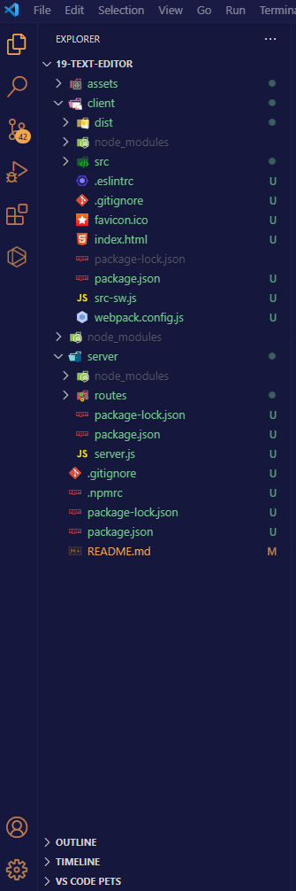
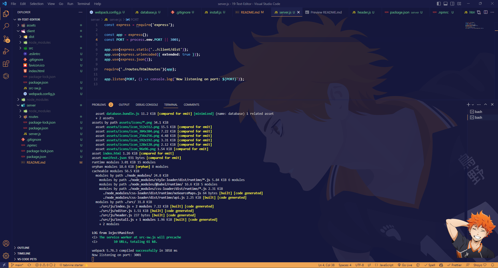
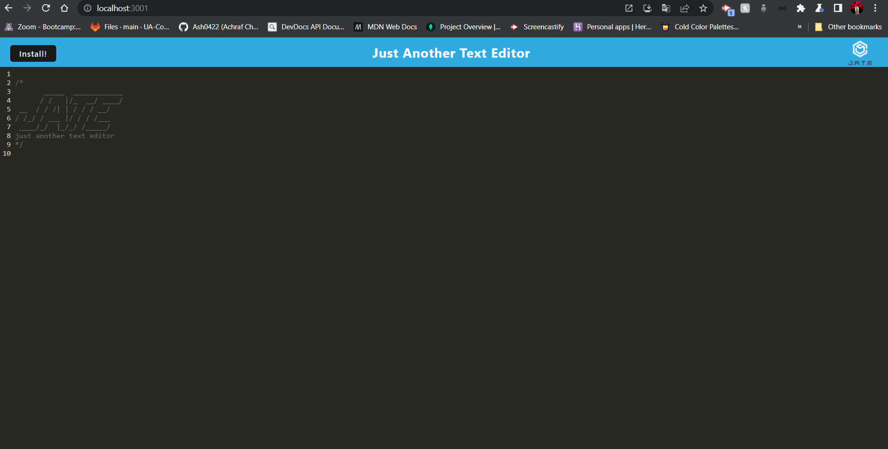
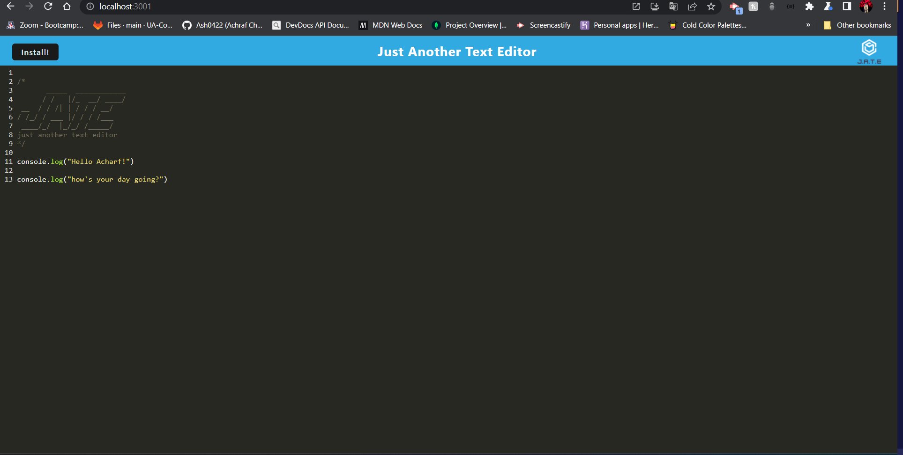
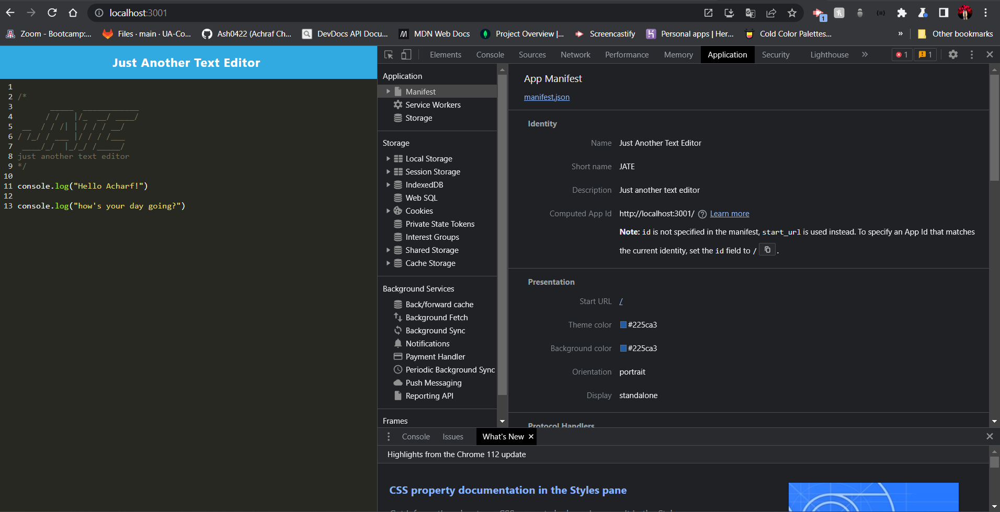
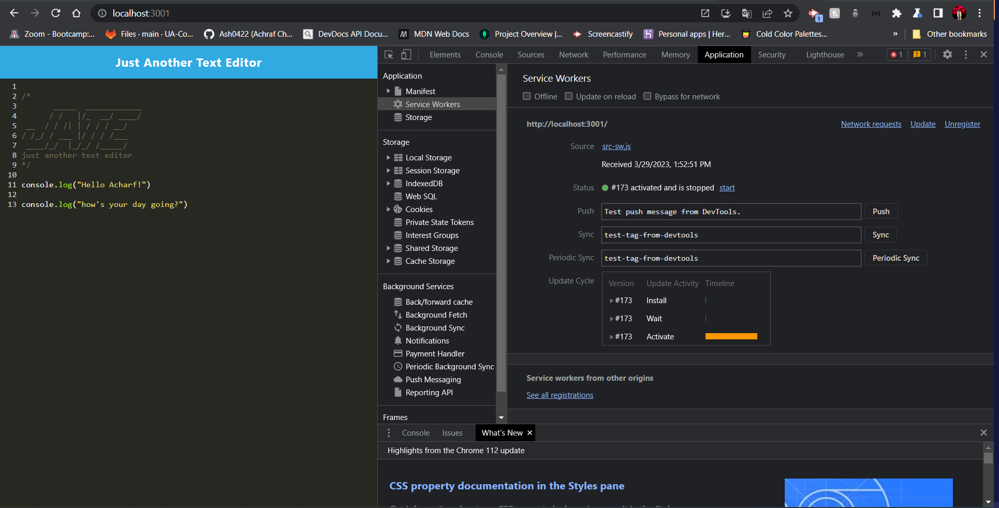
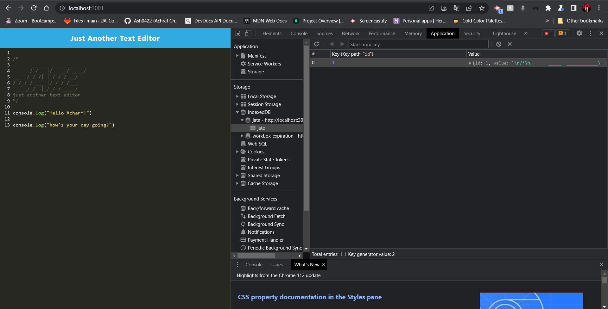

# 19-Text-Editor
[](https://badge.fury.io/gh/yourusername%2Fyourrepo)
[](https://travis-ci.org/yourusername/yourrepo)
[](https://coveralls.io/github/Ash0422/18-Social-Network-API?branch=master)

## Table of Contents

- [Description](#description)
- [Screenshots](#screenshots)
- [Installation](#installation)
- [Usage and DEMO](#usage-and-demogit)
- [User Story](#user-story)
- [Acceptance Criteria](#acceptance-criteria)
- [Contributing](#contributing)
- [Tests](#tests)
- [Credits](#credits)
- [Questions](#questions)

## Description

The text editor is an app that runs in the browser. 
The app will be a single-page application that meets the PWA criteria.
Additionally, it will feature a number of data persistence techniques that serve as redundancy in case one of the options is not supported by the browser. 
The application will also function offline.

## Screenshots
## Folder Structure <br>



## Screenshot of the successfully listening on port 3001



## Screenshot of the application




## The following image shows the application's `manifest.json` file:

## The following image shows the application's registered service worker:

## The following image shows the application's IndexedDB storage: 

## Installation
To install the project follow these steps:
```
1- Clone the application from GitHub with:
   git clone [clone link from GitHub]
2- From the root folder, install the dependencies with:
   npm install
3- Run the app with:
   npm start
```

## Usage and DEMO.

The text editor app is a reliable, modern, and offline-ready tool for creating and storing notes or code snippets.
You can also see a Demo demonstration of the application 


## User Story
```
AS A developer
I WANT to create notes or code snippets with or without an internet connection
SO THAT I can reliably retrieve them for later use
```
## Acceptance Criteria
```
GIVEN a text editor web application
WHEN I open my application in my editor
THEN I should see a client server folder structure
WHEN I run `npm run start` from the root directory
THEN I find that my application should start up the backend and serve the client
WHEN I run the text editor application from my terminal
THEN I find that my JavaScript files have been bundled using webpack
WHEN I run my webpack plugins
THEN I find that I have a generated HTML file, service worker, and a manifest file
WHEN I use next-gen JavaScript in my application
THEN I find that the text editor still functions in the browser without errors
WHEN I open the text editor
THEN I find that IndexedDB has immediately created a database storage
WHEN I enter content and subsequently click off of the DOM window
THEN I find that the content in the text editor has been saved with IndexedDB
WHEN I reopen the text editor after closing it
THEN I find that the content in the text editor has been retrieved from our IndexedDB
WHEN I click on the Install button
THEN I download my web application as an icon on my desktop
WHEN I load my web application
THEN I should have a registered service worker using workbox
WHEN I register a service worker
THEN I should have my static assets pre cached upon loading along with subsequent pages and static assets
WHEN I deploy to Heroku
THEN I should have proper build scripts for a webpack application
```
## Contributing
Pull requests are welcome, please open an issue first to discuss what you would like to change. thank you

## Tests
This application has been tested by the creator and it works fine.<br>
this application has been uploaded to github: https://github.com/Ash0422/19-Text-Editor <br>
this application has been uploaded to Heroku: https://github.com/Ash0422/19-Text-Editor

## Credits
- https://www.npmjs.com/package/express
- https://www.npmjs.com/package/mongoose
- Our classes records. 

## Questions
For any additional questions, please contact me at chibane.tkd04@gmail.com or visit my GitHub profile at https://github.com/Ash0422.

